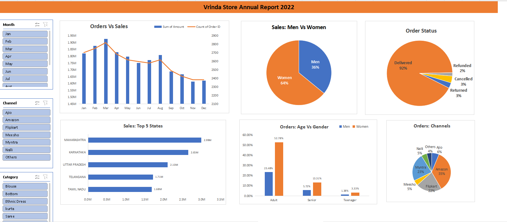

## 📑 Vrinda Store Sales Analysis – Excel Project

## 📌 Project Overview
This project performs end-to-end sales data analysis for Vrinda Store using Microsoft Excel.  
It includes raw data processing, data cleaning, pivot table analysis, chart creation, and a final report/dashboard to generate actionable business insights.



## 🗂️ Dataset
The repository contains:
- Raw transactional sales data
- Cleaned and structured dataset (Sheet: **Vrinda Store**)
- Pivot-based analysis
- Final Excel report with charts and KPIs

## 🛠️ Tools & Techniques Used
- Microsoft Excel  
- Data Cleaning  
- Pivot Tables  
- Pivot Charts  
- Slicers & Filters  
- KPI Metrics  
- Dashboard Creation  

## 🔄 Project Workflow
1. Imported raw sales data  
2. Cleaned the dataset  
   - Removed duplicates  
   - Handled missing values  
   - Standardized categorical fields  
3. Created Pivot Tables for:
   - Monthly sales trend  
   - Category-wise performance  
   - Age & gender analysis  
   - State-wise sales  
   - Channel-wise sales
   - Order Vs Sales 
4. Built charts for visual insights  
5. Developed a final report/dashboard  

## 📊 Key Insights
- Women customers contribute approximately **65%** of total purchases  
- Top 3 states by sales: **Maharashtra, Karnataka, Uttar Pradesh** (~35%)  
- Highest contributing age group: **18–49 years** (~50%)  
- Major sales channels: **Amazon, Flipkart, Myntra** (~80%)  

## 🎯 Business Recommendation
To improve Vrinda Store sales:
- Target **women customers aged 18–49 years**  
- Focus marketing campaigns in **Maharashtra, Karnataka, and Uttar Pradesh**  
- Promote offers and coupons on **Amazon, Flipkart, and Myntra**  

## 📁 Project Structure
```
Excel-Project/
│── Vrinda Store Raw Data.xlsx
│── Vrinda Store Data Analysis-Data cleaned.xlsx
│── LICENSE
│── README.md
```

## 🚀 Outcome
This project demonstrates how Excel can be used for complete data analysis — from raw data cleaning to interactive reporting — and how insights can be translated into actionable business strategies.
